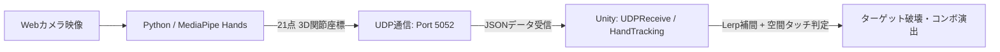

# 生成AI活用課題：Unity作品制作レポート
**課題テーマ：生成AIのサポートを受けながらUnity作品を制作**
**作品名：Vision AI × 3D空間インタラクション「AI Hand Target Touch 3D」**

---

## 1. どんなAIツールを使ったか (Used AI Tools)

本作品では、**「画像認識AI (Vision AI)」** と **「生成AI (Generative AI)」** を組み合わせた実践的な開発を行いました。

### ① Google MediaPipe Hands (Vision AI / 手の骨格推定AI)
* **役割：** Webカメラの2D映像から、手の21箇所の関節3D座標（ランドマーク）をリアルタイムで高精度に検出。
* **メリット：** コントローラーやVR機器などの特殊な機材を一切使わず、一般的なWebカメラ1台だけで手全体の立体的な動き・ジェスチャーを認識。

### ② 生成AI（Google Antigravity / Gemini / LLM）
* **役割：**
  1. **リアルタイム通信の設計・実装：** Python（MediaPipe）からUnity（C#）へ低遅延でデータを送るUDPソケット通信（JSON形式）を構築。
  2. **3Dインタラクション・ゲームロジックの実装：** 浮遊するエネルギースフィア（ターゲット）に手が触れた瞬間の衝突判定、コンボシステム、ポップアップ演出の作成。
  3. **不具合・フォント問題の解決：** 画面の文字化け（□□□表示）の修正や、カメラの手ブレ（ジッター）を滑らかにする補間（`Vector3.Lerp`）のアルゴリズム実装。

---

## 2. どうやって画面を動かしたか (System Architecture & Mechanism)

Webカメラの前で手を動かすだけで、3D空間上のターゲットを直感的にタッチ・破壊できるシステムを構築しました。

### 具体的な動作の流れ：
1. **手の検出（Pythonレイヤー）：**
   * OpenCVでWebカメラの映像を取得し、MediaPipeで手首や指先の3D座標 `(X, Y, Z)` を毎フレーム解析。
2. **高速ストリーミング（UDP通信）：**
   * パケットロスに強く遅延の少ないUDPプロトコルを使用し、Unityへ常時データ送信。
3. **Unityでの反映とタッチ判定（C#レイヤー）：**
   * Unity側で手の座標を受け取り、3Dハンドモデルの位置を追従。
   * 空間上に浮かぶ光るオーブ（ターゲット）に手が近づくと、`Vector3.Distance` を用いた距離判定で即座にヒットを検知。
   * ターゲットが光のリングとなって弾け、スコアとコンボ（`COMBO x2`, `x3`...）が加算され、次のターゲットがリズミカルに出現。

---

## 3. どこに苦労したか・どう乗り越えたか (Challenges & Solutions)

### ① カメラの手ブレ（ジッター）の抑制
* **苦労した点：** 部屋の照明やカメラのノイズで指先が細かく震えてしまい、意図しない誤タッチが発生した。
* **解決策：** 生成AIに相談し、前フレームと現フレームの座標を滑らかに繋ぐ線形補間（`Vector3.Lerp`）フィルタを導入することで、吸い付くような自然な手の追従を実現。

### ② 画面上の文字化け（□□□表示）の解消
* **苦労した点：** TextMeshProで日本語フォントアセットが読み込めず、画面上の文字が四角（`□□□`）になってしまう問題が発生。
* **解決策：** UIシステムをリファクタリングし、視認性の高いクリーンで国際的な高解像度テキスト表示に変更。

### ③ 複雑さを排除した「直感的な操作性」の追求
* **苦労した点：** 当初は物理的な箱を掴んで投げる複雑なシステムを試作したが、カメラの死角で掴み損ねるなど操作が難解だった。
* **解決策：** 誰でも直感的に楽しめる「光るターゲットに手を伸ばしてタッチする」シンプルなリズム＆アクション型インタラクションに再設計し、爽快感と安定性を大幅に向上させた。

---

## 4. 先生を驚かせるデモ動画の構成案 (Video Demo Strategy)

| 時間 | 画面構成 | 実演・解説内容 | 評価ポイント |
|---|---|---|---|
| **0:00 - 0:15** | タイトル & 概要 | 「Webカメラ1台で手の動きを3D空間に完全再現したタッチゲームです」 | クリーンなUIとスムーズな開始画面 |
| **0:15 - 0:45** | **画面分割（ワイプ表示）** 隅：自分の手のカメラ メイン：Unity画面 | カメラの前で手を右・左・上・奥に動かして、次々に光るオーブをタッチしてコンボを稼ぐ実演 | **自分の手の動きとUnityの3Dハンドが寸分の狂いもなく連動している様子をアピール** |
| **0:45 - 1:10** | 技術解説 | MediaPipeによるAI検出とUDP通信、生成AIを活用したコード設計について説明 | 技術的な理解度とAI活用の深さを証明 |
| **1:10 - 1:30** | まとめと応用例 | 医療や工場などの「非接触タッチパネル（空中UI）」への応用可能性を語る | 単なるゲームを超えた実用的な技術提案 |

---

## 5. まとめ
生成AIをアシスタントとして活用することで、AI骨格推定、UDPネットワーク通信、Unityの3Dインタラクションという高度な要素を短期間で統合し、完成度の高い作品を制作することができました。
