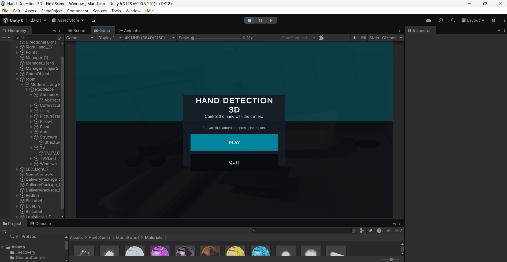
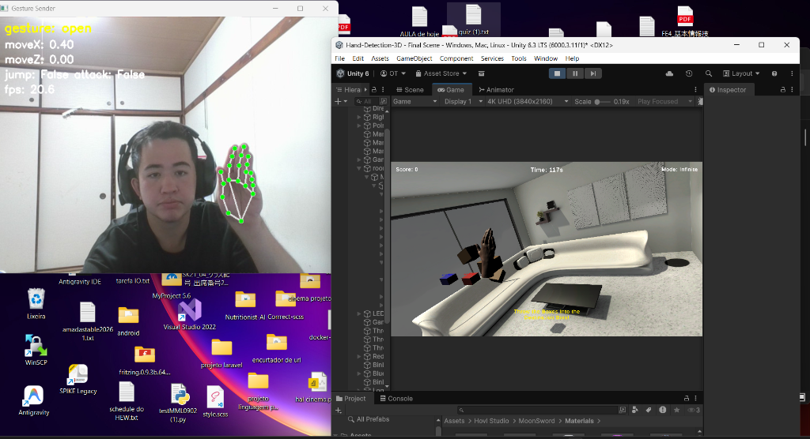
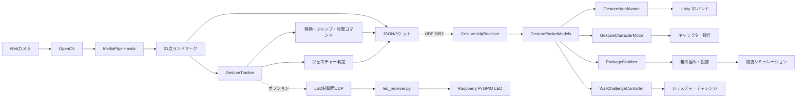
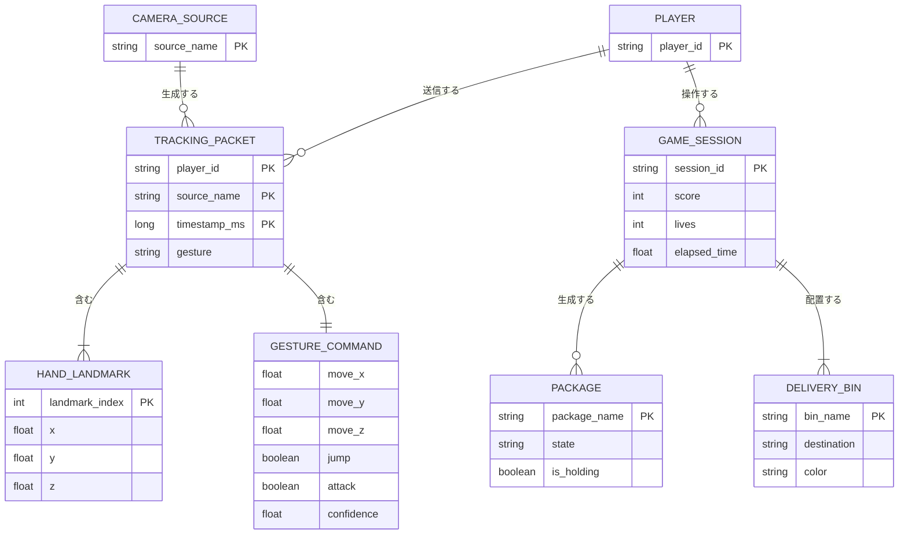

# MediaPipe Unity Hand Tracking

Webカメラで検出した手の動きをUnity上の3D空間へ反映し、ジェスチャーで箱を掴んで投げられる物流シミュレーションを開発しました。

Pythonで手のランドマーク検出とジェスチャー判定を行い、JSON形式のUDP通信でUnityへ送信します。Unity側では受信したデータを3Dハンド、キャラクター操作、箱の掴み・投擲処理へ利用します。

## Demo

| スタート画面 | ハンドトラッキングとゲーム画面 |
| :---: | :---: |
|  |  |

## プロジェクト概要

本作品は、特別なモーションコントローラーを使わず、市販のWebカメラ1台で手の動きを入力にするリアルタイムインタラクションシステムです。

物流倉庫を題材にしたUnity空間で、検出した手の動きを3Dハンドへ反映し、ジェスチャーまたはキーボード・マウスで箱を掴んで投げる操作を実現しました。

本作品で扱っている主な技術要素は以下です。

- MediaPipe Handsによる手の21ランドマーク検出
- 手のランドマークを利用したジェスチャー判定
- PythonからUnityへのUDP/JSON通信
- Unity上での3Dハンド制御
- Rigidbody・Colliderを利用した箱との物理インタラクション

## 背景と課題

物流現場では、作業用手袋の着用や荷物によって、端末やコントローラーを操作しづらい場面があります。そこで、カメラを使った非接触操作を物流作業のシミュレーションに応用できないかと考えました。

開発時には、次の課題がありました。

- カメラ映像から得た手の動きをUnityへリアルタイムに渡す必要がある
- MediaPipeのランドマークにはカメラや照明による揺れがある
- スクリプトで直接座標を変更すると、手と箱の物理的な接触を扱いにくい
- 3Dシーンの座標とカメラから得た座標を対応付ける必要がある

## 課題への解決方法

### PythonとUnityの分離

カメラ映像の取得、MediaPipeによる推論、ジェスチャー判定をPython側で担当させ、Unity側は受信したデータの表示・操作・ゲーム処理に集中させました。

### UDPによるリアルタイム通信

操作ではデータの完全性よりも最新フレームの到着を優先したいため、TCPやHTTPではなくUDPを使用しました。検出結果はJSONにまとめ、ポート5052へ送信します。

### 物理演算との統合

手の中心オブジェクトに`isKinematic = true`のRigidbodyとSphereColliderを動的に追加しました。これにより、手を物理空間上のオブジェクトとして扱い、箱との接触を実現しています。

### 座標とノイズへの対応

Unity側で左右反転、Y/Z方向の反転、スケール、オフセットを設定できるようにし、ランドマークの座標系を3D空間へ変換しています。また、Lerpによる補間で手の動きを平滑化しています。

## システム構成



### システムの流れ

1. Webカメラからフレームを取得
2. OpenCVで画像を前処理
3. MediaPipe Handsで手のランドマーク21点を検出
4. `GestureTracker`で手の状態やスワイプを判定
5. ランドマーク、ジェスチャー、操作コマンドをJSON化
6. UDPでUnityのポート5052へ送信
7. `GestureUdpReceiver`がプレイヤーIDごとの最新パケットを保持
8. `GestureHandAvatar`などが受信データをUnity上の操作へ反映

Unity側には、JSON通信を扱う`GestureUdpReceiver`系の実装に加えて、既存形式に対応する`UDPReceive` / `HandTracking`系の実装もあります。

### ER図（論理モデル）

本プロジェクトはデータベースを使用していないため、以下はUDP/JSONで一時的に扱うデータと、Unityのゲーム状態を表す論理ER図です。実行中のメモリ上のモデルであり、永続化されたテーブル定義ではありません。



`PACKAGE`と`DELIVERY_BIN`の配送先照合は現在実装しておらず、箱がビンに入ったときにスコアを加算する構成です。

## 技術構成

| 分類 | 技術 | 用途 |
| :--- | :--- | :--- |
| 言語 | Python | カメラ処理、MediaPipe実行、ジェスチャー判定 |
| 言語 | C# | Unity側の受信、3D制御、物理処理、ゲーム制御 |
| 認識 | MediaPipe Hands | 手の21ランドマーク検出 |
| 画像処理 | OpenCV | カメラ映像取得、画像変換、デバッグ表示 |
| 通信 | UDP / JSON | PythonからUnityへのリアルタイムデータ送信 |
| 3Dエンジン | Unity 6 `6000.3.11f1` | 3D表示、シーン、ゲーム処理 |
| 物理演算 | Rigidbody / Collider | 手と箱の接触、箱の投擲 |
| UI | TextMesh Pro / uGUI | スタート画面、スコア、タイマーなどの表示 |
| 外部デバイス | Raspberry Pi GPIO | オプションのLED制御 |

Pythonの依存関係は`python/requirements.txt`で管理しています。

## 主な機能

### ハンドトラッキングとジェスチャー入力

- Webカメラから手を検出
- 21点のランドマークを取得
- `open`、`fist`を判定
- `swipe_left`、`swipe_right`、`swipe_up`を判定
- 手の位置から移動コマンドを生成
- 信頼度をJSONパケットに含めて送信

### Unityでの3D制御

- 3Dハンドへランドマークを反映
- 手全体の移動を制御
- Lerpまたは指数平滑化による動きの補間
- ジェスチャーによるキャラクター移動、ジャンプ、攻撃

### 物流シミュレーション

- 箱の自動生成
- 手を近づけて箱を掴む
- 手の移動速度を利用して箱を投げる
- 東京・ロンドンを表す2つのビンを生成
- スコアとHUDを表示
- 無限練習形式で操作を継続

現在の物流ゲームでは、箱がどの配送先に属するかの正誤判定は行わず、ビンへの投入を検出してスコアを加算します。

### その他の機能

- キーボード・マウスによる代替操作
- Unity起動時のPythonトラッキングプログラム起動
- ジェスチャーウォールチャレンジ
- Raspberry Piへの近接状態のUDP送信とLED制御

## 実装・工夫した点

### `python/gesture_sender.py`

- OpenCVでカメラ映像を取得
- MediaPipe Handsをリアルタイム実行
- 指の伸び本数から開いた手・拳を分類
- 手首の履歴からスワイプ方向を検出
- デッドゾーンを設け、微小な手の揺れによる入力を抑制
- JSON形式でランドマークと操作コマンドを送信

### `Assets/GestureControl/`

- UDP受信処理を独立した`GestureUdpReceiver`に分離
- プレイヤーIDごとに最新パケットを管理
- 手のランドマークを3Dモデルへ反映
- 移動、ジャンプ、攻撃のコマンドをUnityのキャラクター制御へ接続

### `Assets/PackageGrabber.cs`

- 手の中心に物理コンポーネントを動的に付与
- 掴んでいる間は箱を手へ追従
- 手の移動速度を投擲方向と力に利用
- キーボード・マウスを代替入力として実装

### 座標問題への対応

部屋モデルとゲームオブジェクトの座標が離れていたため、固定ワールド座標ではなく、実行時の`handCenter`を基準に箱やビンを配置する方式にしました。

## 担当した実装

- `Assets/LogisticsGameController.cs`
  - 物流シミュレーションのゲーム管理、ビン生成、スコア、HUD
- `Assets/PackageGrabber.cs`
  - 箱の生成、掴み、投擲、代替入力、手のCollider設定
- `Assets/HandTracking.cs`
  - JSONパケット処理、座標変換、Lerpによる平滑化
- `Assets/UIFlow/RuntimeStartScreen.cs`
  - 起動画面、ゲーム開始処理、Pythonプログラムの起動・終了
- `python/gesture_sender.py`
  - 手のランドマーク処理、ジェスチャー判定、UDPパケット生成

## セットアップ

### 前提条件

- Unity 6 `6000.3.11f1`
- Python 3.10以上
- Webカメラ

### Python環境

```bash
pip install -r python/requirements.txt
```

トラッキングプログラムを手動で起動する場合は、以下を実行します。

```bash
python python/gesture_sender.py --host 127.0.0.1 --port 5052 --player-id player-1 --camera 0 --show
```

### Unity

1. Unity Editorでプロジェクトを開く
2. `Assets/Scenes/Final Scene.unity`を開く
3. Playボタンを押す
4. カメラの前に手をかざす

`RuntimeStartScreen.cs`からPythonプログラムを起動する構成では、スタート画面の「プレイ」操作後にカメラトラッキングが開始されます。Windowsではまず`python`、見つからない場合は`py`で起動します。OpenCVの映像は`Gesture Sender`という別ウィンドウに表示され、Unityは同じカメラ映像から送られたランドマークを3Dハンドへ反映します。

カメラウィンドウが表示されない場合は、Unity Consoleに`Camera sender error`が出ていないか確認してください。Python環境やカメラ番号を確認するには、以下のバッチファイルを実行できます。

```bat
python/run_camera_tracking.bat
```

### 操作方法

| 操作 | ジェスチャー | 代替操作 |
| :--- | :--- | :--- |
| 掴む | `fist` | Eキー / マウス左クリック |
| 投げる | `open` | Spaceキー / マウス右クリック |

## 今後の発展

完成した作品をさらに発展させる場合の候補です。

1. 箱ごとに配送先情報を持たせ、正しいビンだけを加点する
2. 認識精度、誤認識率、FPS、通信遅延を計測・表示する
3. Python依存ライブラリのバージョンを固定し、実行環境を再現しやすくする
4. 新旧のUDP受信処理を整理する
5. 音声入力や外部デバイスとの連携を追加する
6. VR / AR環境へ対応する
7. 物流作業の訓練結果やスコアを記録できるようにする

## まとめ

本作品では、MediaPipeによる手の検出、Pythonでのジェスチャー判定、UDP通信、Unityの3D・物理演算を組み合わせ、Webカメラだけで操作できる物流シミュレーションを実装しました。

画像認識の結果をリアルタイムアプリケーションの入力へ変換し、ノイズや座標系、物理演算の問題を解決しながら、実際に操作できる形まで統合した点が本作品の中心的な成果です。
