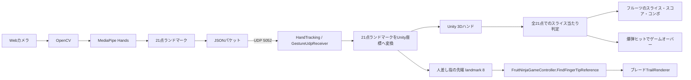
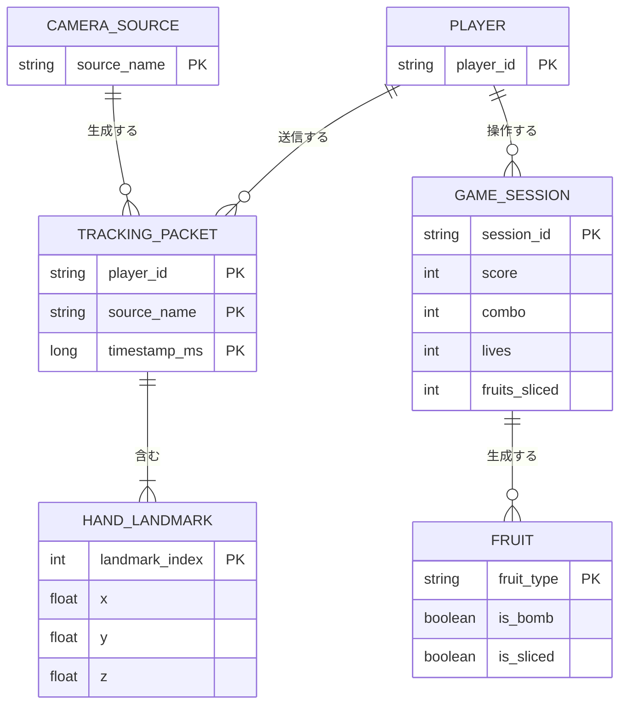

# MediaPipe Unity Fruit Ninja

Webカメラで検出した手の動きをUnity上の3D空間へ反映し、指先の軌跡（ブレード）でフルーツを切るFruit Ninja風のアクションゲームを開発しました。

Pythonで手のランドマーク検出を行い、JSON形式のUDP通信でUnityへ送信します。Unity側では受信したランドマークを3Dハンドへ反映し、人差し指の先端（フィンガーチップ）にブレードの軌跡を表示して、降ってくるフルーツを切る当たり判定・スコア・コンボ処理に利用します。

## Demo

| スタート画面 | ハンドトラッキングとゲーム画面 |
| :---: | :---: |
|  |  |

## プロジェクト概要

本作品は、特別なモーションコントローラーを使わず、市販のWebカメラ1台で手の動きを入力にするリアルタイムインタラクションシステムです。

Unity空間に降ってくるスイカ・リンゴ・オレンジ・バナナ・パイナップルなどのフルーツと爆弾を、検出した手（特に人差し指の先端）の軌跡で切ることでスコアを獲得するアクションゲームです。

本作品で扱っている主な技術要素は以下です。

- MediaPipe Handsによる手の21ランドマーク検出
- 人差し指の先端（フィンガーチップ）を基準にしたブレード（TrailRenderer）の描画
- PythonからUnityへのUDP/JSON通信
- Unity上での3Dハンド制御と当たり判定によるフルーツのスライス処理
- Rigidbody・物理演算を利用したフルーツの放物線挙動と切断エフェクト

## 背景と課題

コントローラーやタッチ操作を使わず、カメラの前で手を振るだけで直感的に遊べるアクションゲームを作れないかと考えました。

開発時には、次の課題がありました。

- カメラ映像から得た手の動きをUnityへリアルタイムに渡す必要がある
- MediaPipeのランドマークにはカメラや照明による揺れがある
- ブレードの軌跡を手のどの部位（手のひら／指先）に追従させるかで、切っている感覚の自然さが大きく変わる
- 3Dシーンの座標とカメラから得た座標を対応付ける必要がある

## 課題への解決方法

### PythonとUnityの分離

カメラ映像の取得、MediaPipeによる推論、ジェスチャー判定をPython側で担当させ、Unity側は受信したデータの表示・操作・ゲーム処理に集中させました。

### UDPによるリアルタイム通信

操作ではデータの完全性よりも最新フレームの到着を優先したいため、TCPやHTTPではなくUDPを使用しました。検出結果はJSONにまとめ、ポート5052へ送信します。

### 指先を基準にしたブレード表示

ブレードの`TrailRenderer`は、MediaPipeのランドマーク8番（人差し指の先端）に追従させています。手のひらやbone（HandCon.bone）に追従させると軌跡が実際の指の動きとずれるため、`FruitNinjaGameController.FindFingerTipReference()`で指先のTransformを優先して取得し、取得できない場合のみ既存のhandTransform（bone等）へフォールバックする実装にしました。

### 物理演算との統合

フルーツは`Rigidbody`を付与して放物線状に打ち上げ、手のランドマーク（指先を含む全21点）との距離判定でスライスを検出します。前フレームとの位置を線分として扱うことで、高速に振った手でも取りこぼしにくくしています。

### 座標とノイズへの対応

Unity側で左右反転、Y/Z方向の反転、スケール、オフセットを設定できるようにし、ランドマークの座標系を3D空間へ変換しています。また、Lerpによる補間で手の動きを平滑化しています。

## システム構成



### システムの流れ

1. Webカメラからフレームを取得
2. OpenCVで画像を前処理
3. MediaPipe Handsで手のランドマーク21点を検出
4. ランドマークをJSON化
5. UDPでUnityのポート5052へ送信
6. `HandTracking`が最新パケットを受信し、21点を3Dハンドへ反映
7. `FruitNinjaGameController`が人差し指の先端（landmark 8）にブレードの軌跡を表示し、全ランドマークとフルーツの距離からスライスを判定

Unity側には、JSON通信を扱う`GestureUdpReceiver`系の実装に加えて、既存形式に対応する`UDPReceive` / `HandTracking` / `HandCon` / `HandCon2`系の実装もあります。

### ER図（論理モデル）

本プロジェクトはデータベースを使用していないため、以下はUDP/JSONで一時的に扱うデータと、Unityのゲーム状態を表す論理ER図です。実行中のメモリ上のモデルであり、永続化されたテーブル定義ではありません。



landmark_index 8（人差し指の先端）がブレードの位置に、全ランドマークがスライスの当たり判定に使われます。爆弾（is_bomb）を切るとゲームオーバーになります。

## 技術構成

| 分類 | 技術 | 用途 |
| :--- | :--- | :--- |
| 言語 | Python | カメラ処理、MediaPipe実行、ジェスチャー判定 |
| 言語 | C# | Unity側の受信、3D制御、物理処理、ゲーム制御 |
| 認識 | MediaPipe Hands | 手の21ランドマーク検出 |
| 画像処理 | OpenCV | カメラ映像取得、画像変換、デバッグ表示 |
| 通信 | UDP / JSON | PythonからUnityへのリアルタイムデータ送信 |
| 3Dエンジン | Unity 6 `6000.3.11f1` | 3D表示、シーン、ゲーム処理 |
| 物理演算 | Rigidbody / Collider | フルーツの放物線挙動、スライス判定 |
| UI | TextMesh Pro / uGUI | スタート画面、スコア、タイマーなどの表示 |
| 外部デバイス | Raspberry Pi GPIO | オプションのLED制御 |

Pythonの依存関係は`python/requirements.txt`で管理しています。

## 主な機能

### ハンドトラッキング

- Webカメラから手を検出
- 21点のランドマークを取得
- 座標の反転・スケール・オフセットを調整して3D空間へ変換
- 信頼度・座標をJSONパケットに含めて送信

### Unityでの3D制御

- 3Dハンドへ21点のランドマークを反映
- 人差し指の先端（landmark 8）にブレードの軌跡（TrailRenderer）を表示
- Lerpまたは指数平滑化による動きの補間

### フルーツスライスゲーム

- スイカ・リンゴ・オレンジ・バナナ・パイナップル・爆弾をランダムに放物線で打ち上げ
- 手（特に指先）とフルーツの距離、および前フレームとの軌跡（スイープ判定）でスライスを検出
- スライスに成功するとスコア加算・コンボ倍率アップ・果肉パーティクルとハーフカットモデルを生成
- 爆弾を切るとゲームオーバー、Rキーまたはクリックでリスタート
- スコア・ハイスコア・残りライフ・コンボバナーをHUDに表示

### その他の機能

- キーボード・マウスによる代替操作
- Unity起動時のPythonトラッキングプログラム起動
- Raspberry Piへの近接状態のUDP送信とLED制御（オプション）

## 実装・工夫した点

### `python/gesture_sender.py`

- OpenCVでカメラ映像を取得
- MediaPipe Handsをリアルタイム実行
- 指の伸び本数から開いた手・拳を分類
- 手首の履歴からスワイプ方向を検出
- デッドゾーンを設け、微小な手の揺れによる入力を抑制
- JSON形式でランドマークと操作コマンドを送信

### `Assets/GestureControl/`

- UDP受信処理を独立した`GestureUdpReceiver`に分離
- プレイヤーIDごとに最新パケットを管理
- 手のランドマークを3Dモデルへ反映
- 移動、ジャンプ、攻撃のコマンドをUnityのキャラクター制御へ接続

### `Assets/FruitNinjaGameController.cs`

- フルーツと爆弾の生成、放物線の物理挙動
- 全ランドマーク・手のTransformを使ったスライス判定（直接距離＋前フレームとの線分判定）
- 人差し指の先端（landmark 8）を優先してブレードの`TrailRenderer`を追従させる`FindFingerTipReference()`
- スコア・コンボ・ライフ・HUD・ゲームオーバー処理

### 座標問題への対応

部屋モデルとゲームオブジェクトの座標が離れていたため、固定ワールド座標ではなく、実行時の手の位置（`handTransform`）を基準にフルーツの落下位置や打ち上げ高さを計算する方式にしました。

## 担当した実装

- `Assets/FruitNinjaGameController.cs`
  - フルーツスライスゲームのゲーム管理、フルーツ生成、スライス判定、スコア・コンボ・HUD
- `Assets/HandTracking.cs`
  - JSONパケット処理、座標変換、Lerpによる平滑化
- `Assets/HandCon.cs` / `Assets/HandCon2.cs` / `Assets/HandController.cs`
  - 手のボーン回転・位置制御
- `Assets/UIFlow/RuntimeStartScreen.cs`
  - 起動画面、ゲーム開始処理、Pythonプログラムの起動・終了
- `python/gesture_sender.py`
  - 手のランドマーク処理、UDPパケット生成

## セットアップ

### 前提条件

- Unity 6 `6000.3.11f1`
- Python 3.10以上
- Webカメラ

### Python環境

```bash
pip install -r python/requirements.txt
```

トラッキングプログラムを手動で起動する場合は、以下を実行します。

```bash
python python/gesture_sender.py --host 127.0.0.1 --port 5052 --player-id player-1 --camera 0 --show
```

### Unity

1. Unity Editorでプロジェクトを開く
2. `Assets/Scenes/Final Scene.unity`を開く
3. Playボタンを押す
4. カメラの前に手をかざす

`RuntimeStartScreen.cs`からPythonプログラムを起動する構成では、スタート画面の「プレイ」操作後にカメラトラッキングが開始されます。Windowsではまず`python`、見つからない場合は`py`で起動します。OpenCVの映像は`Gesture Sender`という別ウィンドウに表示され、Unityは同じカメラ映像から送られたランドマークを3Dハンドへ反映します。

カメラウィンドウが表示されない場合は、Unity Consoleに`Camera sender error`が出ていないか確認してください。Python環境やカメラ番号を確認するには、以下のバッチファイルを実行できます。

```bat
python/run_camera_tracking.bat
```

### 操作方法

| 操作 | 手の動き | 代替操作 |
| :--- | :--- | :--- |
| スライス | 人差し指の先端を降ってくるフルーツに当てる | マウスカーソルの移動 |
| リスタート | - | Rキー / マウスクリック（ゲームオーバー時） |

## 今後の発展

完成した作品をさらに発展させる場合の候補です。

1. フルーツの種類ごとに得点や演出を差別化する
2. 認識精度、誤認識率、FPS、通信遅延を計測・表示する
3. Python依存ライブラリのバージョンを固定し、実行環境を再現しやすくする
4. 新旧のUDP受信処理を整理する
5. 音声入力や外部デバイスとの連携を追加する
6. VR / AR環境へ対応する
7. スコアランキングやプレイ履歴を記録できるようにする

## まとめ

本作品では、MediaPipeによる手の検出、UDP通信、Unityの3D・物理演算を組み合わせ、Webカメラだけで操作できるFruit Ninja風のアクションゲームを実装しました。

画像認識の結果をリアルタイムアプリケーションの入力へ変換し、ノイズや座標系、指先の軌跡の追従、物理演算の問題を解決しながら、実際に操作できる形まで統合した点が本作品の中心的な成果です。
